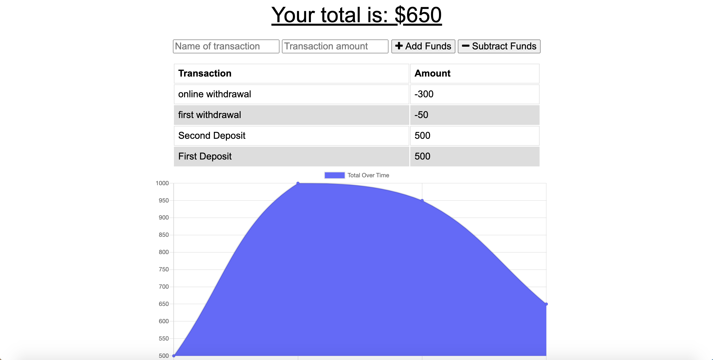

# PWA_Budget_Tracker

# Table of contents
1. [Project Description](#descriptionLink)
2. [Deployed App](#deployedLink)
3. [Install](#installLink)
4. [UI](#uiLink)
5. [Version](#versionLink)
6. [Stack](#dependenciesLink)
7. [Contact](#contactLink)


----

## Project Descripton <a name="descriptionLink"></a>
This Budget Tracker progressive web application (PWA) allows a user to add and subtract from a budget. Data from each transaction is rendered onto a table and chart. 

This PWA works online and offline. While offline, transactions are stored locally in IndexedDB and then updated in a MongoDB database when back online. 

Additionally, using a webmanifest and service worker, this app can be installed as a mobile app.

## Deployed App <a name="installLink"></a>
[Go to app:](https://intense-journey-40815.herokuapp.com/)


## Install <a name="installLink"></a>
To install dependencies run ```npm i```

To start application, run ```npm start```

## UI <a name="uiLink"></a>



## Version <a name="versionLink"></a>


## Stack  <a name="dependenciesLink"></a>

-MongoDB and mongoose

-Express

-Node.js

## Contact <a name="contactLink"></a>


 
#### Github Username: [@reyesdmusic](https://www.github.com/reyesdmusic)
#### Email: reyesdmusic@gmail.com